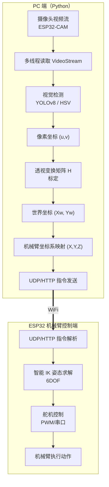
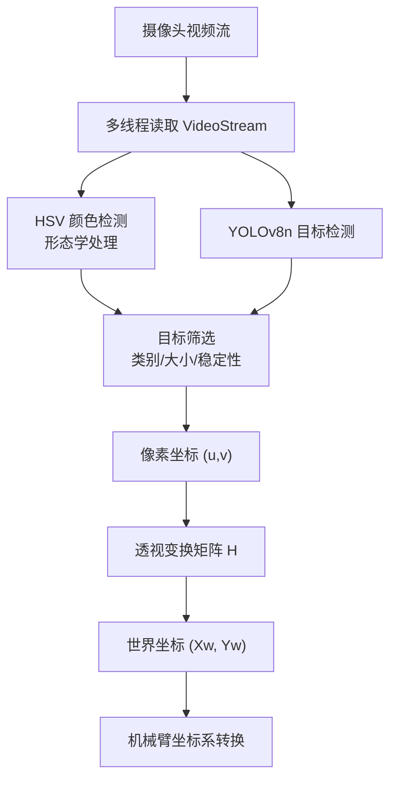
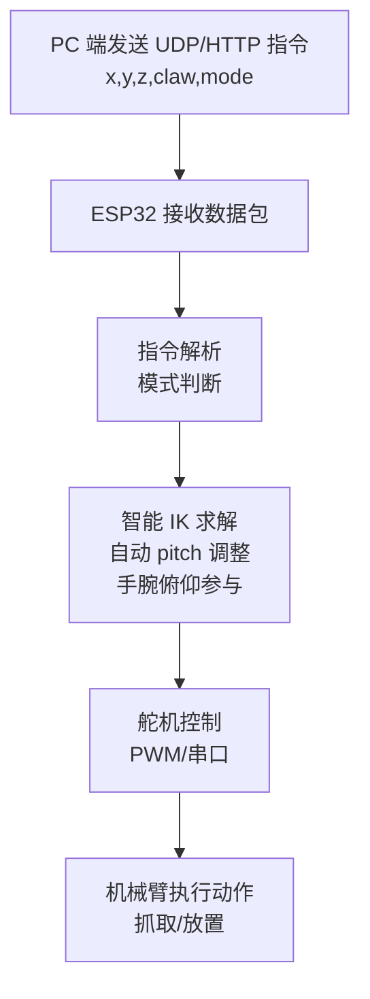

# 🌟 LeArm Vision & Gesture Control System  
基于 YOLOv8 + MediaPipe + ESP32 的 6DOF 机械臂智能视觉抓取与手势控制系统

---

## 🧩 技术栈

---

# 🚀 项目简介

本项目实现了：

- 🎯 **YOLOv8 俯视视觉抓取（支持小物体 < 5cm）**
- 🖐️ **MediaPipe 手势控制机械臂（实时跟随）**
- 🎨 **HSV 颜色分拣（红绿蓝）**
- 📡 **UDP + HTTP 双通道通信**
- 🤖 **智能 IK 姿态控制（Z→pitch 自动调整）**
- 📐 **A4 纸四点透视标定（像素→世界坐标）**

这是一个完整的 **视觉 + 控制 + 机械臂** 工程项目。

---

🏗️ 系统总体架构

---
👁️ 视觉处理流程

---
🤖 机械臂控制流程

✨ 功能亮点
🔹 YOLOv8 俯视抓取

🔹 MediaPipe 手势控制
手腕位置 → X/Y/Z

食指弯曲 → 夹爪开合

死区 + 滤波 → 稳定控制

🔹 智能 IK 姿态控制（6DOF）
Z 低 → 垂直向下抓取

Z 高 → 更水平，避免无解

手腕俯仰自由参与 IK

🔹 透视标定（A4 纸）
点击四角 → 自动求单应矩阵

像素坐标 → 世界坐标（cm）

机械臂坐标系自动对齐

