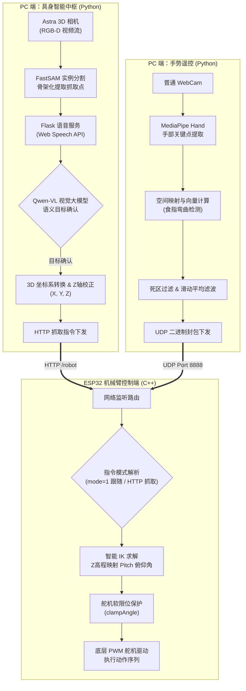
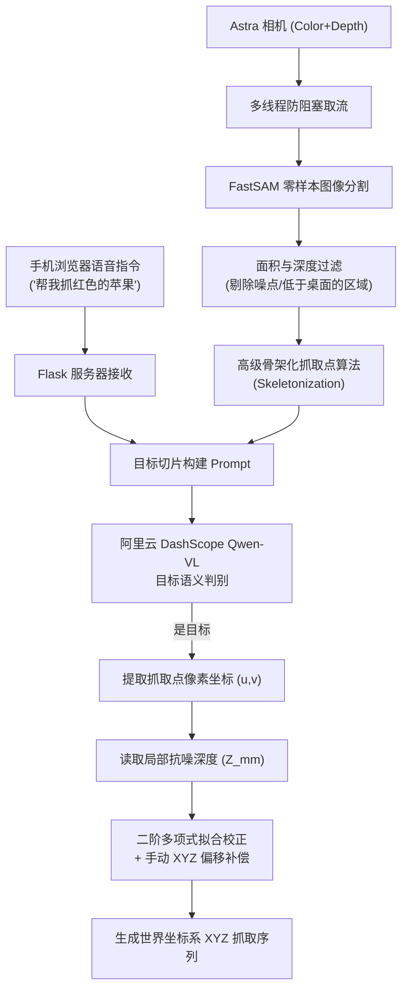
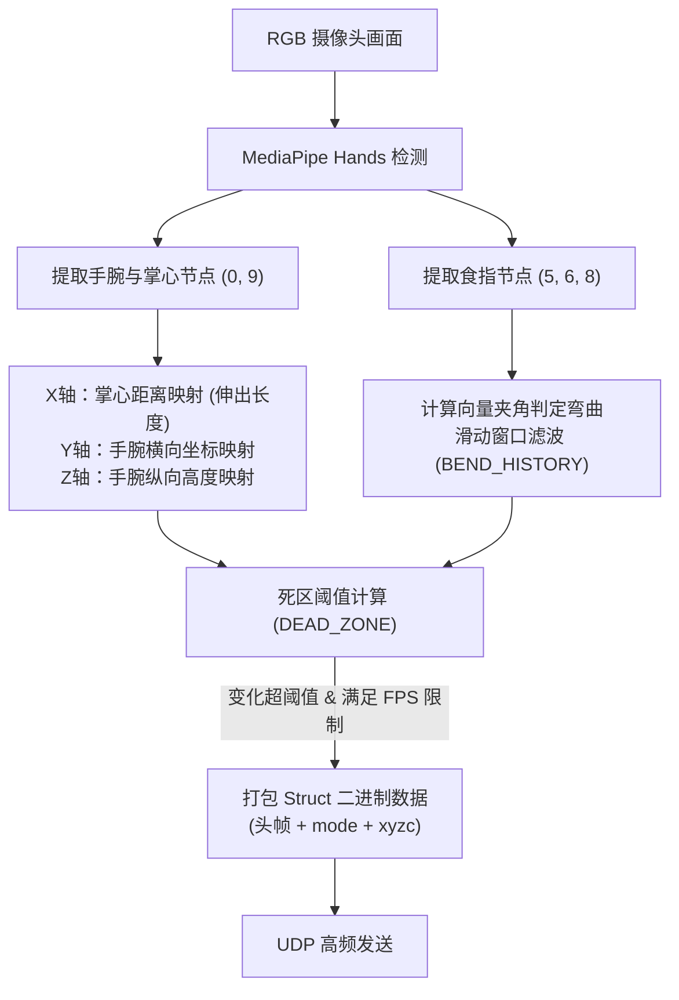

# 🌟 LeArm Embodied AI & Gesture Control System  
基于 FastSAM + Qwen-VL + MediaPipe + Astra 3D相机的 6DOF 机械臂具身智能与手势控制系统

---

## 🧩 技术栈

---

# 🚀 项目简介

本项目实现了一个高度集成的具身智能（Embodied AI）机械臂控制系统，包含三大核心模块：

- 🧠 **大模型驱动的视觉抓取**：结合 FastSAM 零样本分割与阿里通义千问 Qwen-VL 多模态大模型，实现基于自然语言的语义理解与目标抓取。
- 👁️ **3D RGB-D 空间感知**：基于 Astra 3D 相机与 OpenNI2，结合二阶多项式 Z 轴自动校正与骨架化（Skeletonization）高级抓取点算法。
- 🖐️ **空间手势遥控操纵**：使用 MediaPipe 追踪手部三维节点，实现基于 UDP 的低延迟实时跟随与食指弯曲动作映射。
- 📡 **双通道异构通信**：视觉/大模型端采用 HTTP 可靠传输，手势遥控端采用 UDP 二进制高频传输。
- 🤖 **智能 IK 姿态求解**：ESP32 端内置逆运动学解算，动态依据 Z 轴高度调整末端 Pitch 俯仰角，并配备软限位安全机制。

---

## 🏗️ 系统总体架构

```mermaid
flowchart TD
    subgraph PC_Vision ["PC 端：具身智能中枢 (Python)"]
        V1["Astra 3D 相机<br>(RGB-D 视频流)"] --> V2["FastSAM 实例分割<br>骨架化提取抓取点"]
        V2 --> V3["Flask 语音服务<br>(Web Speech API)"]
        V3 --> V4{"Qwen-VL 视觉大模型<br>语义目标确认"}
        V4 -->|目标确认| V5["3D 坐标系转换 & Z轴校正<br>(X, Y, Z)"]
        V5 --> V6["HTTP 抓取指令下发"]
    end

    subgraph PC_Gesture ["PC 端：手势遥控 (Python)"]
        G1["普通 WebCam"] --> G2["MediaPipe Hand<br>手部关键点提取"]
        G2 --> G3["空间映射与向量计算<br>(食指弯曲检测)"]
        G3 --> G4["死区过滤 & 滑动平均滤波"]
        G4 --> G5["UDP 二进制封包下发"]
    end

    V6 ==>|HTTP /robot| ESP32
    G5 ==>|UDP Port 8888| ESP32

    subgraph ESP32_Node ["ESP32 机械臂控制端 (C++)"]
        ESP32["网络监听路由"] --> C1{"指令模式解析<br>(mode=1 跟随 / HTTP 抓取)"}
        C1 --> C2["智能 IK 求解<br>Z高程映射 Pitch 俯仰角"]
        C2 --> C3["舵机软限位保护<br>(clampAngle)"]
        C3 --> C4["底层 PWM 舵机驱动<br>执行动作序列"]
    end
```
---
##👁️ 大模型视觉与抓取流程

```mermaid
flowchart TD
    A1["Astra 相机 (Color+Depth)"] --> A2["多线程防阻塞取流"]
    A2 --> A3["FastSAM 零样本图像分割"]
    A3 --> A4["面积与深度过滤<br>(剔除噪点/低于桌面的区域)"]
    A4 --> A5["高级骨架化抓取点算法<br>(Skeletonization)"]
    
    U1["手机浏览器语音指令<br>('帮我抓红色的苹果')"] --> U2["Flask 服务器接收"]
    U2 --> A6
    
    A5 --> A6["目标切片构建 Prompt"]
    A6 --> A7["阿里云 DashScope Qwen-VL<br>目标语义判别"]
    A7 -->|是目标| A8["提取抓取点像素坐标 (u,v)"]
    A8 --> A9["读取局部抗噪深度 (Z_mm)"]
    A9 --> A10["二阶多项式拟合校正<br>+ 手动 XYZ 偏移补偿"]
    A10 --> A11["生成世界坐标系 XYZ 抓取序列"]
```
---
##🖐️ 手势控制工作流

```mermaid
flowchart TD
    B1["RGB 摄像头画面"] --> B2["MediaPipe Hands 检测"]
    B2 --> B3["提取手腕与掌心节点 (0, 9)"]
    
    B3 --> B4["X轴：掌心距离映射 (伸出长度)<br>Y轴：手腕横向坐标映射<br>Z轴：手腕纵向高度映射"]
    B2 --> B5["提取食指节点 (5, 6, 8)"]
    B5 --> B6["计算向量夹角判定弯曲<br>滑动窗口滤波 (BEND_HISTORY)"]
    
    B4 --> B7["死区阈值计算 (DEAD_ZONE)"]
    B6 --> B7
    B7 -->|变化超阈值 & 满足 FPS 限制| B8["打包 Struct 二进制数据<br>(头帧 + mode + xyzc)"]
    B8 --> B9["UDP 高频发送"]
```
---
##✨ 功能亮点核心机制
#🔹 具身智能视觉与大模型 (VLM)
自然语言命令：手机端通过 Web 麦克风说话，直接发送文本指令至 Python 后台。
FastSAM + Qwen-VL：先通过 FastSAM 筛选画面内所有独立物体，按距离画面中心排序；再逐一切片发给 Qwen-VL-Plus 进行 VQA（视觉问答），确认后立即锁定目标。
骨架化抓取 (Skeleton Grasp)：摒弃简单的质心抓取，提取物体二值化掩码的形态学骨架，沿法线计算局部宽度，选取最适合机械爪开合度的有效位置进行抓取。
#🔹 3D 感知与坐标校准
RGB-D 深度抗噪：基于区域百分位数滤波（过滤极值噪点），提升 Astra 相机深度数据稳定性。
Z轴自适应校正：采用二阶多项式（c0 + c1*x + c2*y + c3*x^2 + c4*y^2 + c5*x*y）拟合实测标定误差数据，自动抵消相机畸变与机械臂系统误差。
动态 HUD 面板：基于 OpenCV 实时显示 XYZ 空间坐标、校准偏移量、系统状态与物体 3D 骨架层叠加。
#🔹 MediaPipe 空间手势操控
三维空间映射：手腕画面位置映射 Y/Z，手掌相对大小（透视原理）映射机械臂的 X（伸出距离）。
向量点积防抖：通过食指关节 6->5 与 6->8 向量的点积求夹角，严格判断食指是否真实弯曲以控制夹爪。
UDP 二进制通信：采用 struct.pack("<BB B B f f f f") 结构体封包，剔除 JSON 开销，实现 20FPS 的极低延迟控制。
#🔹 ESP32 智能逆运动学 (IK)
智能 Pitch 俯仰调整：根据目标高度 Z自动插值计算最佳夹爪俯仰角.
防烧毁软限位 (Soft Limits)：底层引入 clampAngle 边界限制，强行屏蔽非法的 XYZ 坐标或溢出角度，保护舵机寿命。
平滑动作生成：通过指定 moveTime 与指令缓冲，使机械臂在高速手势跟随和精准视觉抓取中表现丝滑。
